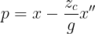
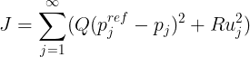

# ZMP-Based Walking Pattern Generation

​	Implementation of walking pattern generation using ZMP (Zero Moment Point) method. For detailed formulas and explanation, please refer to [1].

​	

## Background

​	ZMP is an approach for making the moving robot keep balance. If ZMP is inside the support polygon (the rectangles, which are also the footprints), then the robot does not fall down.

​	Hence, with given ZMP positions, the goal is to deduce the trajectory of CoM (center of mass).

## Formulas

​	The robot walking model is simplified to a cart-table model and the corresponding ZMP equation is following

​	Rewrite it into the state space representation

​	Discretize the continuous-time system using a sample time

​	The goal is to let the system output $p_j$ match the target ZMP $p^{ref}_j$, so we can consider this problem as an optimization problem minimizing the following performance, where $Q$ and $R$ are positive weights.

​	According to the preview control theory, the performance is minimized by the following input which uses the future target references up to $N$ steps (I never learned about this theory and cannot understand the full mathematics here :( ). $P$ is the solution of a Riccati equation and it can be easily computed by scipy.

​	**Warning:** The offset tracking error of ZMP in a long distance walking pattern occurs in this $u_k$ formula, so [1] and [2] use the improved version.

## Results

## Reference

[1] Kajita S, Hirukawa H, Harada K, et al. Introduction to humanoid robotics[M]. Springer Berlin Heidelberg, 2014.

[2] Park J, Youm Y. General ZMP preview control for bipedal walking[C]//Proceedings 2007 IEEE international conference on robotics and automation. IEEE, 2007: 2682-2687.

[3] Kajita S, Kanehiro F, Kaneko K, et al. Biped walking pattern generation by using preview control of zero-moment point[C]//2003 IEEE International Conference on Robotics and Automation (Cat. No. 03CH37422). IEEE, 2003, 2: 1620-1626.

[4] https://github.com/yiqin/Preview-Control-Motion-Planning-in-Humanoid

[5] https://github.com/zanppa/WPG
